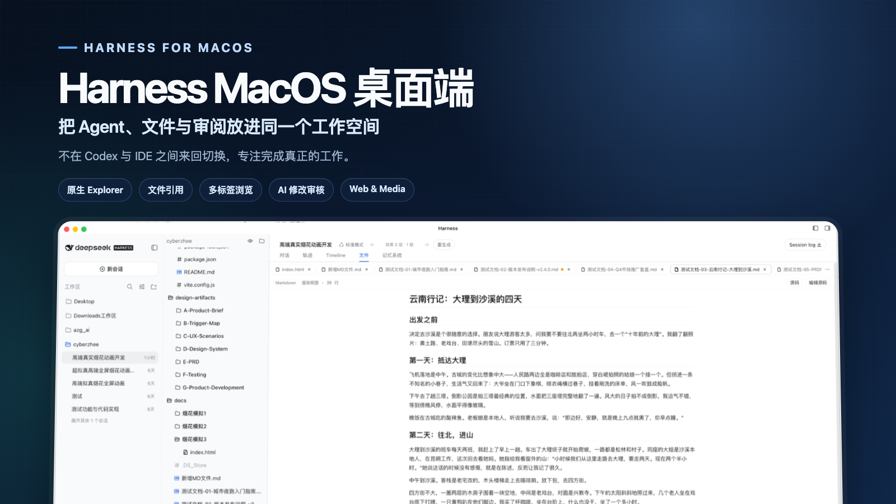
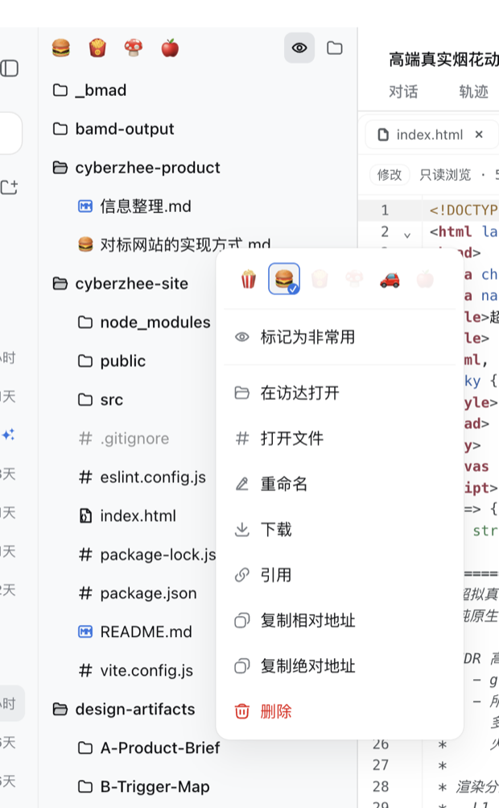
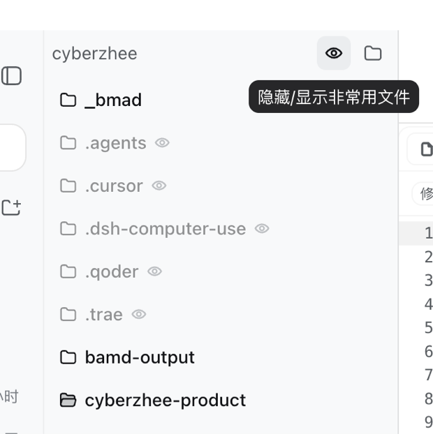
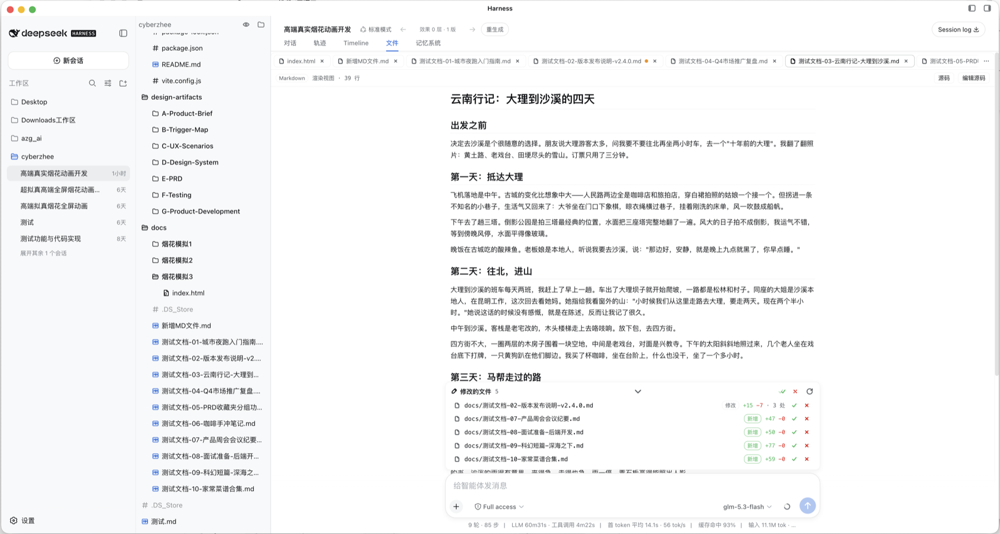
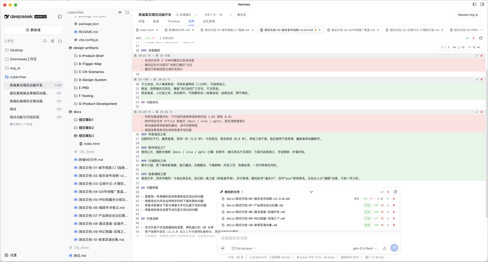
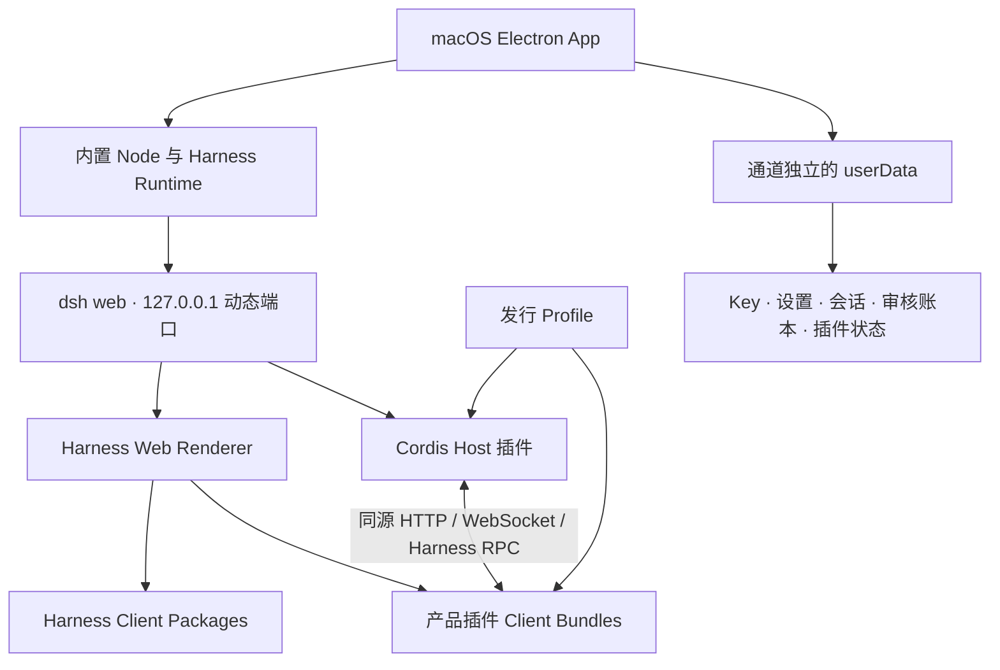

# Harness macOS Desktop & Plugin Suite

主文档 | [中文镜像](README.zh.md)

<div align="center">
  
</div>

<div align="center">
  <br>
  <strong>一个为 AI 办公重新设计的 macOS 桌面工作台</strong>
  <br><br>
  <a href="#设计理念">设计理念</a> ·
  <a href="#产品特色">产品特色</a> ·
  <a href="#终端快速体验">快速体验</a> ·
  <a href="#当前公开发行状态">发行边界</a>
  <br><br>
  
  
  
</div>

面向日常办公场景的 macOS AI 工作台：基于 [DeepSeek Harness](https://github.com/deepseek-ai/deepseek-harness) 二次开发，把 Agent 对话、文件浏览与网页/多媒体浏览整合进同一个桌面 App，并保留 Harness 的 Cordis 插件架构和 Agent 能力，在统一工程中维护 Electron 桌面封装、必要的 Harness Web 定制、五个产品插件以及可复现的 Dev/Stable 打包流程。

市面上的 Agent 生产力工具长期难以在 Codex 与 IDE 之间取得平衡：用 Codex 开发，模型更强，但它的文件浏览、文件管理器等侧边栏不好用，甚至功能尚不成熟；回到 IDE，写代码、看代码顺手，但浏览 Markdown 要切换渲染视图，日常写文档的办公能力也捉襟见肘。本项目从「日常办公用 AI」这个需求重新出发，重构一套把浏览文件与对话 AI 摆到同等位置的工作台。

> 本项目是社区第三方项目，并非 DeepSeek 官方产品。仓库公开的是可审查源码快照，不代表 Stable App 已完成签名、公证或公开二进制发行验证；上游 Harness 仍处于开发者预览阶段，后续更新可能包含兼容性破坏性变更。

## 设计理念

- **浏览文件优先**：浏览文件的需求不亚于、甚至重于与 AI 对话，因此把最大的显示面积留给文件浏览，与 AI 对话统一收纳成标签。
- **干净的 Explorer**：完整的资源管理器之上，用快捷标记收藏常用文件夹、快速直达，用「非常用」标记隐藏碍事文件，让工作区始终只留要看的内容。
- **引用打通**：想把「某文档第几行」指给模型修改时，直接从文件管理器或文件视图生成引用；这类需求在 Codex 里几乎无法实现，回到 IDE 又要面对文件浏览与办公能力的短板。
- **边看边做的右侧边栏**：网页、图片、视频等工程里需要浏览、但不是主操作的内容放进右侧边栏，边开发网页边在同一窗口里看渲染效果。

## 产品特色

### macOS 桌面体验

**Harness 以原生 macOS App 形态运行，开箱即用，数据始终留在 App 之外**：

- **独立桌面封装**：使用 Electron 将 Harness Runtime、Web 后端和产品 Profile 封装为独立 macOS App，启动时自动拉起本机回环地址上的 Harness Web 服务。
- **三栏工作台布局**：正式界面采用会话列表、Explorer 文件树和对话主面板三栏布局，支持亮色与暗黑主题。
- **平滑启动**：启动页使用与三栏结构一致的简洁骨架占位，跟随上次主题，并在主界面就绪后平滑淡出。
- **通道隔离**：Dev 与 Stable 使用不同的 App 标识和用户数据目录；重新打包会复用各自通道已有的模型 Key、设置和偏好，但这些数据始终保存在 App 外部，不写入源码或发行包。
- **版本可辨**：「关于 App」显示构建时写入的版本号、构建时间和 Dev/Stable 通道，便于区分测试包与正式候选包。

### 干净的 Explorer

**一个清爽的资源管理器是工作台的地基**：完整的文件树之上，用快捷标记收藏常用文件、用隐藏收起碍事内容，让工作区始终只留要看的东西。

- **快捷标记**：文件或文件夹可绑定固定的 Emoji 快捷标记，点击标记即可展开、定位并打开对应路径；常用文件夹设置标记后即可快速直达，标记在 App 重启后继续保留。
- **隐藏非常用**：不常用、碍事的文件或文件夹可标记为「非常用」，通过眼睛按钮统一隐藏或显示；标记和隐藏开关都会跨重启持久化。
- **复用与刷新**：Explorer 以工作区为单位缓存已加载目录，同一工作区切换不同会话时直接复用文件树，同时保留定时刷新以发现 AI、Finder 或其他进程产生的变化。
- **安全拖动**：文件和文件夹都能拖入其他目录，也能移回工作区根目录；Host 会再次检查工作区边界、符号链接、循环移动和同名冲突。
- **右键操作**：右键菜单提供引用、复制路径、在访达中显示等常用操作。

<table>
  <tr>
    <td width="55%" align="center"></td>
    <td width="45%" align="center"></td>
  </tr>
  <tr>
    <td align="center"><strong>为常用资源设置快捷标签</strong></td>
    <td align="center"><strong>隐藏干扰，随时恢复显示</strong></td>
  </tr>
</table>

### 浏览文件优先的多标签布局

**把最大的显示面积留给文件浏览，AI 对话与文件统一收纳成标签**：在同一个视图里通过标签切换文件与对话。

- **文件视图**：代码、普通文本和 Markdown 进入顶部「文件」视图，支持多标签、CodeMirror 编辑、Markdown 渲染以及「关闭所有文件 / 关闭已处理文件」。
- **工作区外只读**：工作区外的普通文本产物也能通过受限的 opaque ID 在「文件」中只读打开，不会因此获得保存或编辑权限。
- **右侧浏览边栏**：网页、图片、PDF、DOCX、XLSX、PPTX 和视频共享右侧 Browser/Preview 标签栏，可切换、关闭、拖动排序并按会话恢复标签状态；边开发网页边在同一窗口里看渲染效果。
- **视频流式播放**：MP4、M4V、WebM、MOV 和 OGV 使用 HTTP Range 流式读取，不把完整视频载入 Node 内存；播放器提供播放、暂停、进度、缓冲、音量、倍速、全屏、画中画和局部键盘控制。
- **自动暂停**：切换视频标签、收起右栏或切换会话会自动暂停；不支持的容器或编码会显示明确错误，并提供系统播放器和下载兜底。

<div align="center">
  
</div>

### 打通对话框与文件的引用

**想把「某文档第几行」指给模型修改时，直接从文件管理器或文件视图生成引用**：这类需求在 Codex 里几乎无法实现，回到 IDE 又要面对文件浏览与办公能力的短板；本工作台在对话框、文件管理器和文件浏览器之间打通了引用。

- **统一引用入口**：Explorer 右键引用、文件视图选区引用和其他统一入口都会生成结构化文件引用。
- **紧凑气泡**：引用在 Harness 原生输入框中显示为紧凑气泡，模型仍能收到可从会话日志重建的完整引用内容。
- **不牺牲输入体验**：引用气泡与原生文本输入共用同一套 occurrence/draft 机制，不牺牲 Shift+Enter、中文输入法、撤销、删除、光标移动或长文本滚动体验。

### 面向人类审核的文件变更

**AI 对文件的每一次改动都先经过人审核，删除前必有可恢复副本**：

- **改动进账本**：AI 通过 `write`、`edit`、`file_move` 和 `file_delete` 产生的新增、修改、移动和删除，直接写入当前会话审核账本，不依赖扫描整个工作区。
- **内外皆可审**：工作区内外的 AI 文件变化都能进入待审核列表；工作区外条目只以 Host 签发的审核 ID 执行接受或拒绝，界面中的绝对路径仅用于展示。
- **行级 Diff**：文件视图提供易读的行级 Diff、语法高亮、逐块或整文件接受/拒绝、批量操作和拒绝撤销。
- **删除可恢复**：AI 删除文件或目录前，内容先进入持久隔离区并生成删除墓碑；目录删除按一个批次展示，可展开查看所有子文件、整批接受，或完整恢复目录结构和内容。
- **删除前快照**：被 AI 删除的文本文件仍可从审核入口只读查看删除前快照，文件标签使用红色删除线表达删除状态。
- **严格门禁**：可写 Shell 工具受到严格门禁；AI 删除必须经过结构化 `file_delete`，确保删除前已有可恢复副本并进入审核流程。

<div align="center">
  
</div>

### 会话编辑与谱系

**历史消息可编辑、可重试，每次改动都保留成可回看的真实分支**：

- **编辑与重试**：Message Edit 支持编辑历史消息、重生成最后回复、重试任意回合，以及 truncate/preserve 两种级联策略。
- **真实版本而非原地改写**：每次编辑或重试都会创建真实的新会话版本，不原地改写 append-only 会话日志；原分支仍可访问。
- **两级谱系树**：Workspace Lineage 将工作区与会话组织成两级谱系树，支持父会话、分支会话重命名、最近更新排序和自定义分支标题持久化。

### Office 与 Notebook 能力

**Agent 按单元格、页面或幻灯片精读 Office 文件，用户则在右侧边栏直接看预览**：

- **结构化读取**：Cowork 为 Agent 提供 XLSX、PDF、DOCX、PPTX 和 Jupyter Notebook 的结构化读取能力。
- **精确定位读写**：XLSX 与 Notebook 支持按单元格或 Cell 定位的创建和编辑；PDF、DOCX 和 PPTX 可按页面、段落或幻灯片读取。
- **读写与预览分离**：Agent 工具能力负责结构化读写，右侧只读 Preview 负责视觉浏览——前者给模型用，后者给人看。

## 架构



架构分为四个协作层：

1. **Electron Desktop**：负责窗口、主题启动占位、Runtime/Profile 启动引导、通道隔离和本地后端生命周期。
2. **Harness Runtime**：基于上游 Harness 源码构建，提供 Agent、Session、模型、工具、凭据和 Web UI 基础设施。
3. **Product Profile**：由仓库内白名单生成，决定哪些 Cordis Host 插件和 Client bundle 随 App 装配；构建不会读取已安装 Stable Profile 作为模板。
4. **Product Plugins**：Host 负责文件系统、持久化和本地 HTTP 路由，Client 负责 React UI、标签、文件预览和交互。两端只通过明确的 JSON、HTTP、WebSocket 或 Harness 服务契约通信。

Electron Renderer 不直接获得 Node 文件系统权限。文件读取、审核、媒体 Range 和 Explorer 操作都由 Host 校验会话、路径与权限后执行；App 内 Runtime、Profile 和 `.app` 是可重建产物，不是源码维护入口。

## 产品插件与定制

发行 Profile 固定装配以下产品插件：

| 插件 | 来源 | 本项目中的职责与定制 |
| --- | --- | --- |
| [`dsh-better-sidebar`](plugins/better-sidebar/README.md) | 基于 [DSH Better Sidebar](https://github.com/omdsh-dev/DSH-better-sidebar) 持续定制 | 三栏布局、Explorer 缓存与拖动、Emoji/非常用标记、统一文件路由、Browser/Preview 共用多标签、图片/PDF/Office/视频预览、视频 Range 流式播放、关于页面 |
| [`dsh-file-edit`](plugins/file-edit/README.md) | 基于社区 File Edit 插件持续定制 | 顶部文件标签、代码与 Markdown、引用协议、事件驱动审核、工作区外审核与只读浏览、事务化文件/目录删除、隔离恢复、删除墓碑、严格删除门禁 |
| [`dsh-message-edit`](plugins/message-edit/README.md) | 基于 [DSH Message Edit](https://github.com/Moeblack/dsh-message-edit) 定制 | 消息编辑、Reroll、Retry、真实会话 Fork、版本事件、撤销/重做与 Timeline |
| [`dsh-workspace-lineage`](plugins/workspace-lineage/package.json) | 项目维护的 Workspace Browser 分支 | 工作区两级会话树、父子谱系、分支名称持久化、重命名、最近更新与手动排序 |
| [`@dsh-cowork/plugin`](plugins/cowork/README.md) | 集成并定制 [DSH Cowork](https://github.com/Jesse-njx/dsh-cowork) | Office/Notebook 结构化读写工具及其 Host 装配 |

引用气泡、原生输入稳定性和冷会话首屏等跨插件能力位于 Harness Web 核心包；插件局部能力继续留在各自目录。产品组成的机器可读权威来源是 [`distribution/profile-manifest.json`](distribution/profile-manifest.json) 与 [`distribution/cordis.patch.yml`](distribution/cordis.patch.yml)。

## 工程目录

```text
desktop/       Electron macOS 桌面壳、打包、安装和发行验证
distribution/  产品插件白名单与 Cordis composition patch
plugins/       Better Sidebar、File Edit、Message Edit、Workspace Lineage、Cowork
packages/      DeepSeek Harness 核心与本项目必要的 Web 定制
vendor/        随 Harness 源码维护的 Cordis 及基础库
scripts/       Harness 与产品级构建、测试、文档和隐私检查
docs/          架构、开发、迁移和维护资料
```

统一工程把 `src/` 与可维护源码归为源码面（source plane），把 `lib/`、`dist/`、`.artifacts/`、Profile、Runtime 和 `.app` 归为产物面（artifact plane）；开发只改前者，不从已安装 App 或用户 Profile 反向覆盖源码。

<a id="run"></a><a id="run-from-source"></a>

## 终端快速体验

当前暂未提供已签名、公证的公开安装包。使用 macOS Apple Silicon 的用户可以在终端下载源码、构建并打开独立的 Dev App：

```bash
git clone --depth 1 https://github.com/snzhi000-sys/harness-macos-desktop-plugin-suite.git
cd harness-macos-desktop-plugin-suite
corepack enable
pnpm install
npm run product:dist:dev
open "desktop/dist/dev/mac-arm64/DeepSeek Harness Dev.app"
```

首次构建需要下载依赖并生成 Runtime 与产品 Profile，所需时间取决于网络和机器性能。Dev App 使用独立数据目录，不会覆盖已安装的 Stable App。

## 本地开发

### 环境

- macOS Apple Silicon；当前桌面构建目标为 arm64。
- Node.js `^22.19.0` 或 `>=24.0.0`。
- pnpm `11.7.0`。

```bash
pnpm install
```

### 插件开发与验证

```bash
npm run product:build:plugins
npm run product:test:plugins
npm run product:test:desktop
npm run product:verify:privacy
npm run product:verify:profile-runtime
```

`product:verify:privacy` 会检查已跟踪文件和未被忽略的未跟踪文件；`product:verify:profile-runtime` 会在隔离环境验证五个产品插件的 Host 装配、Client 启动清单和空白会话创建主链路。

修改单个插件时应先运行该插件 `package.json` 声明的定向 build/test，再执行上述产品装配检查。用户可见功能还需要在测试工作区和测试会话中做真实回归，不能只以 bundle 存在或后端 ready 作为验收结论。

### 构建 Dev App

```bash
npm run product:dist:dev
```

产物位于：

```text
desktop/dist/dev/mac-arm64/DeepSeek Harness Dev.app
```

Dev 使用独立的 Bundle ID 和 `DeepSeek Harness Dev` userData。产品打包脚本会重建全部产品插件，在固定 `.candidate-dev` 目录生成候选，核验 Dev 身份、版本、构建时间、包内功能标记、签名和隐私，再以 `--user-data-dir=<临时绝对路径>` 自动完成不迁移凭据的干净启动；全部通过后才覆盖固定 `dist/dev` 输出。日常启动发布后的 Dev 会继续使用 Dev 自己的 Key、设置和工作区偏好，不会读取或覆盖 Stable 数据。

### 构建 Stable 候选

只有 Dev 自动化、独立 userData 启动和真实功能回归通过后，才构建 Stable 候选：

```bash
npm run product:dist:stable
```

产物位于：

```text
desktop/dist/stable/mac-arm64/DeepSeek Harness.app
```

Stable 复用同一产品打包脚本并使用固定 `.candidate-stable` 暂存目录，执行插件重建、桌面测试、源码隐私检查、Runtime/Profile 构建、五插件运行装配、包身份与功能标记、隔离启动及发行包解包扫描，并写入新的版本、构建时间与 `stable` 通道。全部通过后只覆盖固定 `dist/stable`；构建候选不会安装或替换 `/Applications/DeepSeek Harness.app`。

本地维护者需要安装 Stable 候选时，必须先确认没有正在运行的 Agent 任务，保留回滚点，再显式运行桌面安装流程。安装器会优先把现有 App 保存为 `DeepSeek Harness.previous.app`，但不会复制、清空或迁移 Stable userData，因此模型 Key、会话、审核账本、Explorer 状态和其他用户配置仍保留在 App 外部。

## 隐私与发行安全

- Profile 只从 [`distribution/profile-manifest.json`](distribution/profile-manifest.json) 的产品白名单生成，不复制本机已安装 Profile、第三方个人插件或用户配置。
- 源码与发行包隐私检查拒绝凭据文件、私钥、数据库、会话、日志、个人主目录路径和绝对软链接。
- `.env`、`.credentials.yaml`、`settings.yaml`、sessions、storages、Mnemon、审核隔离区、userData、Runtime 和构建产物均不进入 Git。
- Dev 与 Stable 的配置继承依靠系统用户数据目录，而不是把 Key 或个人文件打进 `.app`。
- 公开发布前仍需检查完整 Git 历史、第三方许可证、Developer ID 签名、Apple 公证、Gatekeeper、DMG/ZIP 与校验和。

详细迁移边界见[统一工程迁移执行计划](docs/MIGRATION_PLAN.zh-CN.md)，当前验证事实与未完成项见[迁移状态](docs/migration/STATUS.zh-CN.md)。

## 当前公开发行状态

本分支用于审查可公开源码快照。以下事项关闭前，不应将 Stable `.app` 标记为正式公开发行版：

- File Edit、Message Edit 和 Workspace Lineage 的独立来源与许可证授权仍需完成确认。
- Message Edit 当前包含可运行 Host/Client 快照，但缺少完整的 Host TypeScript 可复现维护源和历史构建链。
- 当前本地候选只使用 ad-hoc 签名，尚未完成 Developer ID 签名、Apple 公证与 Gatekeeper 发行验证。
- 公开安装包仍需完整 UI 回归、发行归档、校验和与组件许可证清单。

## 上游 Harness

DeepSeek Harness (`dsh`) 是 DeepSeek AI 开发的开源 Agent Harness，采用「一切皆插件」的 Cordis 架构。上游资料：

- [DeepSeek Harness 仓库](https://github.com/deepseek-ai/deepseek-harness)
- [本仓库开发指南](docs/development.md)
- [本仓库架构文档](docs/architecture.md)
- [贡献指南](CONTRIBUTING.md)

## 作者与致谢

- 作者：[zhee](https://github.com/snzhi000-sys)
- 项目地址：[harness-macos-desktop-plugin-suite](https://github.com/snzhi000-sys/harness-macos-desktop-plugin-suite)
- 上游：[DeepSeek Harness](https://github.com/deepseek-ai/deepseek-harness)

感谢 Better Sidebar、File Edit、Message Edit 与 Cowork 等社区项目提供的基础能力。各组件来源和许可证以仓库内说明与 [THIRD_PARTY_NOTICES.md](THIRD_PARTY_NOTICES.md) 为准。

## License

仓库根源码沿用 [MIT License](LICENSE)，第三方依赖及许可证见 [THIRD_PARTY_NOTICES.md](THIRD_PARTY_NOTICES.md)。产品插件仍分别受其来源许可证和授权约束；当前公开审查分支中的许可证待确认项以上一节为准。
