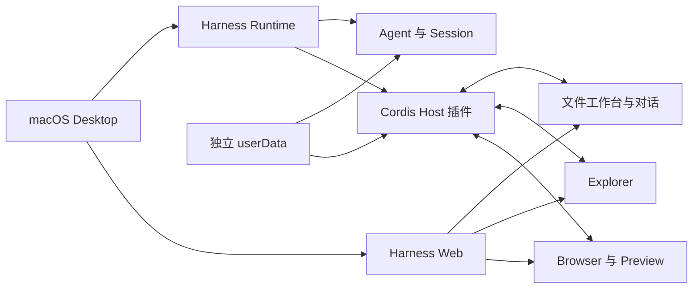

# Harness for macOS

主文档 | [中文镜像](README.zh.md)

<div align="center">
  
</div>

<div align="center">
  <br>
  <strong>一个为 AI 办公重新设计的 macOS 桌面工作台</strong>
  <br><br>
  <a href="#为什么需要-harness-for-macos">为什么做</a> ·
  <a href="#核心体验">核心体验</a> ·
  <a href="#从源码运行">从源码运行</a> ·
  <a href="#开源与发行边界">开源边界</a>
  <br><br>
  
  
  
</div>

> 本项目是基于 [DeepSeek Harness](https://github.com/deepseek-ai/deepseek-harness) 的社区第三方项目，并非 DeepSeek 官方产品。它保留 Harness 的 Agent 与 Cordis 插件能力，并围绕 macOS 桌面办公重新设计文件管理、内容浏览、引用沟通和 AI 修改审核体验。

## 为什么需要 Harness for macOS

强大的 Agent 往往出现在 Codex 一类工具中，而成熟的文件浏览和代码导航往往出现在 IDE 中。真实工作因此被拆成两半：让 Agent 处理任务时使用一个工具，查找、阅读和整理文件时又切回另一个工具。

这种分工对纯编码尚可接受，对日常办公却并不自然。Markdown、方案、报告、网页、多媒体和 Office 文档不是附属品，它们就是工作本身。传统 IDE 擅长写代码，但很少把文档阅读、文件整理和 AI 协作当作同等重要的主流程；许多 Agent 客户端拥有更强的模型，却仍只有非常基础的文件侧栏。

Harness for macOS 由此采用一个不同的起点：**文件浏览与 AI 对话同等重要，很多时候甚至更重要。** 它把主要显示面积交给文件工作台，让 Explorer、文档、多标签内容和审核视图与对话处在同一个窗口中。

它不是要替代所有 IDE，而是补上 Agent 与 IDE 之间长期缺失的那一块：一个更适合阅读、整理、沟通和审核的 AI 办公工作台。

## 核心体验

### 1. 文件是工作台的中心，不是对话框的附件

Harness 提供完整的 Explorer 与顶部文件工作台。代码、普通文本和 Markdown 可以在多标签中打开；Markdown 支持渲染视图，文档阅读不再被压缩在狭窄侧栏或藏在另一个应用里。

<div align="center">
  
</div>

主要内容区用于浏览文件，对话框保持随时可用。你可以一边阅读方案，一边让 Agent 修改内容，再回到同一个标签页检查结果，不必在 Agent 客户端、Finder 和 IDE 之间来回切换。

### 2. Explorer 会记住什么重要，也允许隐藏干扰

常用工程的目录越多，传统文件树越容易被层级和工具目录淹没。Harness 为文件和文件夹提供 Emoji 快捷标签：给常用位置设置标签后，可以快速识别并定位真正重要的内容。

不重要但又不能删除的目录可以标记为“非常用”。Explorer 支持统一隐藏或显示这些项目，让日常视图保持干净，同时随时能够找回完整目录。

<table>
  <tr>
    <td width="55%" align="center"></td>
    <td width="45%" align="center"></td>
  </tr>
  <tr>
    <td align="center"><strong>用标签找到常用内容</strong></td>
    <td align="center"><strong>隐藏干扰，保留完整工程</strong></td>
  </tr>
</table>

Explorer 还支持拖动整理、移回工作区根目录、复制路径、在访达中显示和文件下载。状态按工作区持久保存，切换会话时无需重新整理文件树。

### 3. 从“看见一段内容”直接走到“让 Agent 修改它”

在很多 Agent 工具里，告诉模型“修改这个文档的第 23 行到第 31 行”并不容易。IDE 虽然可能支持代码引用，却又把人带回以编码为中心的工作流。

Harness 打通了 Explorer、文件浏览器与对话输入框。你可以引用整个文件，也可以在文件视图中选中具体内容后引用；引用会作为清晰的气泡进入对话，同时保留模型真正需要的文件位置和内容上下文。

这让沟通从模糊的“那个文档里有一段”变成可以复核的明确输入，也减少手工复制路径、行号和大段正文的成本。

### 4. AI 可以直接工作，但每次文件修改都由人确认

Agent 产生的新增、修改、移动和删除会进入会话审核账本。文件工作台提供可读的行级 Diff、语法高亮、逐块或整文件接受与拒绝，也支持批量处理和拒绝撤销。

<div align="center">
  
</div>

删除操作会先保存可恢复内容并生成删除记录。即使原文件已经被 Agent 删除，仍可在审核入口查看删除前快照，并选择接受或恢复。这样既保留 Agent 直接完成任务的效率，也不放弃人对最终文件状态的控制。

### 5. 网页与多媒体留在手边，但不抢占主工作区

网页、图片、PDF、Office 文档和视频经常是工程上下文的一部分，却不一定值得占据主操作区。Harness 将 Browser 与 Preview 放在右侧可收起面板中，并支持多标签切换和会话恢复。

开发网页时可以在同一窗口查看页面效果；阅读方案时可以并排参考 PDF、图片或视频。主文件工作台仍保持最大面积，需要参考内容时再展开右栏。

### 6. 会话可以演进，而不是覆盖历史

消息编辑、重新生成和任意回合重试会创建真实的新会话版本，不会原地改写 append-only 会话日志。Workspace Lineage 将工作区、父会话与分支会话组织成谱系树，便于回到旧思路或继续新的方向。

## 能力概览

| 工作场景 | Harness for macOS 提供的能力 |
| --- | --- |
| 文件整理 | 完整 Explorer、拖动、Emoji 标签、非常用隐藏、工作区状态持久化 |
| 文档与代码浏览 | 顶部多标签、Markdown 渲染、代码与普通文本查看、工作区外只读产物 |
| 与 Agent 沟通 | 文件引用、选区引用、结构化引用气泡、中文输入与长文本编辑 |
| AI 文件修改 | 事件驱动审核、行级 Diff、逐块/整文件接受拒绝、批量操作与撤销 |
| 安全删除 | 删除前快照、持久隔离区、目录批次审核与完整恢复 |
| 网页与媒体 | Browser/Preview 多标签、图片、PDF、Office、视频 Range 流式播放 |
| 会话演进 | 消息编辑、Reroll、Retry、真实会话 Fork 与 Workspace Lineage |
| Office 与 Notebook | XLSX、PDF、DOCX、PPTX、Jupyter Notebook 的结构化读写工具 |

## 架构



Electron 桌面壳负责窗口、Runtime/Profile bootstrap、Dev/Stable 通道隔离和本地后端生命周期。Renderer 不直接获得 Node 文件系统权限；文件读取、审核、媒体 Range 和 Explorer 操作都由 Host 校验会话、路径与权限后执行。

发行 Profile 固定装配 Better Sidebar、File Edit、Message Edit、Workspace Lineage 和 Cowork 五个产品插件。产品组成的机器可读真源是 [`distribution/profile-manifest.json`](distribution/profile-manifest.json) 与 [`distribution/cordis.patch.yml`](distribution/cordis.patch.yml)。

<a id="run"></a><a id="run-from-source"></a><a id="从源码运行"></a>

## 从源码运行

### 环境要求

- macOS Apple Silicon
- Node.js `^22.19.0` 或 `>=24.0.0`
- pnpm `11.7.0`

```bash
pnpm install
npm run product:build:plugins
npm run product:test:plugins
npm run product:test:desktop
npm run product:verify:privacy
npm run product:verify:profile-runtime
```

构建测试包：

```bash
npm run product:dist:dev
```

固定输出路径：

```text
desktop/dist/dev/mac-arm64/DeepSeek Harness Dev.app
```

构建 Stable 候选：

```bash
npm run product:dist:stable
```

固定输出路径：

```text
desktop/dist/stable/mac-arm64/DeepSeek Harness.app
```

产品打包脚本会重建插件，校验 App 标识、版本、构建时间、包内功能标记、签名和隐私，并使用临时 userData 完成隔离启动。只有全部验证通过的候选才会覆盖对应通道的固定输出；Stable 候选不会自动安装到 `/Applications`。

## 项目结构

```text
desktop/       Electron macOS 桌面壳、打包、安装和发行验证
distribution/  产品插件白名单与 Cordis composition patch
plugins/       产品插件及其 Host/Client 源码
packages/      DeepSeek Harness 核心与必要的 Web 定制
vendor/        随 Harness 源码维护的 Cordis 及基础库
scripts/       产品构建、测试、文档和隐私检查
docs/          架构、开发、迁移和维护资料
```

开发只修改 source plane 中的可维护源码，不从 `lib/`、`dist/`、Runtime、Profile、已安装 App 或用户数据反向覆盖仓库。

## 开源与发行边界

仓库公开的是可审查源码，不代表当前 Stable `.app` 已满足公开二进制发行条件。面向互联网分发仍需要完成第三方插件来源与许可证确认、Developer ID 签名、Apple 公证、Gatekeeper 验证、完整 UI 回归、发行归档和 checksums。

源码与发行隐私检查拒绝凭据、私钥、会话、日志、数据库、个人主目录路径和绝对软链接。模型 Key、设置、会话、审核账本和插件状态保存在 App 外部的通道独立 userData 中，不进入仓库或发行包。

## 作者与致谢

- 作者：[zhee](https://github.com/snzhi000-sys)
- 项目地址：[harness-macos-desktop-plugin-suite](https://github.com/snzhi000-sys/harness-macos-desktop-plugin-suite)
- 上游：[DeepSeek Harness](https://github.com/deepseek-ai/deepseek-harness)

感谢 Better Sidebar、File Edit、Message Edit 与 Cowork 等社区项目提供的基础能力。各组件来源和许可证以仓库内说明与 [THIRD_PARTY_NOTICES.md](THIRD_PARTY_NOTICES.md) 为准。

## License

仓库根源码采用 [MIT License](LICENSE)。第三方依赖及其许可证见 [THIRD_PARTY_NOTICES.md](THIRD_PARTY_NOTICES.md)。
